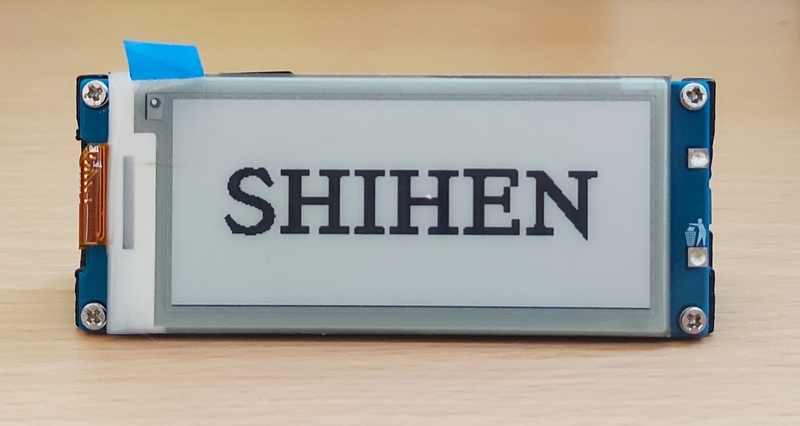
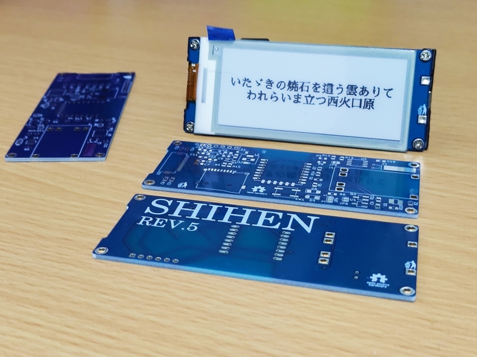
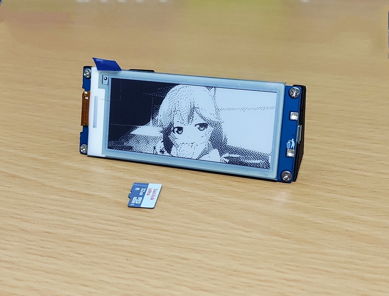
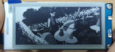
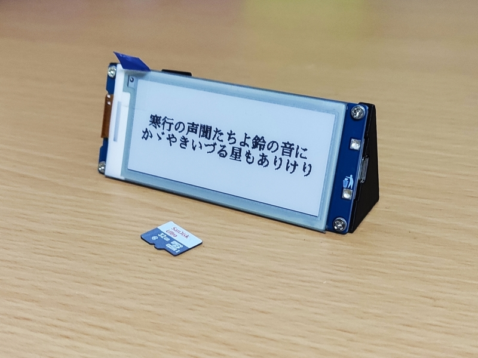
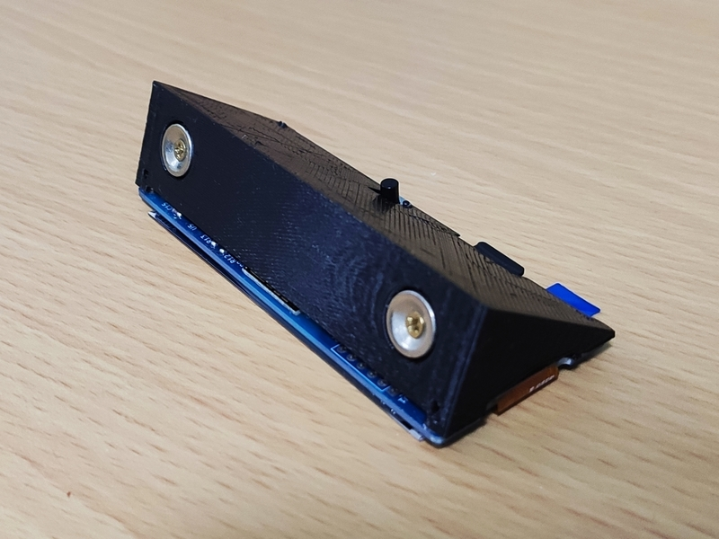

  

**SHIHEN** is a device which colors your everyday (a bit).  
Have a glimpse of your favorite poems, quotes or scenes of a movie.

## Features
- On board RTC offers 2+ years of battery life.([in theory](https://blc.now.sh/?config=eyJiYXR0ZXJ5Q2FwYWNpdHkiOiIzNTAiLCJzbGVlcEN1cnJlbnRNaWxpcyI6MC4wMDUsIndha2VDdXJyZW50TWlsaXMiOiI4MCIsIndha2V1cENvdW50IjoiMTIiLCJ3YWtldXBVbml0Ijo4NjQwMCwid2FrZXVwU2VjIjoiMSJ9))
- By using [a dedicated Web-based converter](https://shihen.now.sh/), you can quickly show any texts and videos on the device.

## Gallery
|    |  |
| :------------------------------------------------------------------------------: | :----------------------------------------------------------------------------: |
|  |  |
|    |                                                                                |

## Project structure
- [`pio/`](./pio) - code for the firmware(PlatformIO)
- [`kicad/`](./kicad) - PCB design (KiCad)
- [`openscad/`](./openscad) - models for the 3D-printable case. (OpenSCAD)
- https://github.com/likeablob/shihen-webui - code for the WebUI(Vue.js + Buefy)

## Build Instructions
WIP

## BOM
WIP

## Refs
- Hackaday.io: https://hackaday.io/project/168039-shihen