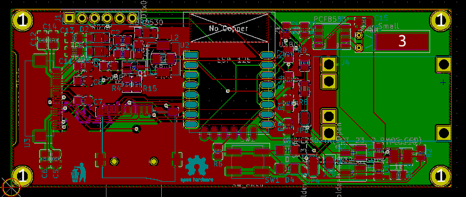

# SHIHEN/PCB

  

## Prerequisites
- [KiCAD](http://kicad-pcb.org/) v5.0.1

## Credits
- [jdunmire]'s [ESP-12E.kicad_mod](./lib_ext/ESP-12E.kicad_mod): borrowed from [jdunmire/kicad-ESP8266](https://github.com/jdunmire/kicad-ESP8266/tree/70e6530de5e3cae4ae77a4bca7d73b20a0af6baf)
- [Joan_Sparky]'s [Conn_uSDcard.kicad_mod](./lib_ext/Conn_uSDcard.kicad_mod): borrowed from  https://forum.kicad.info/t/microsd-component-footprint-help/3095/5