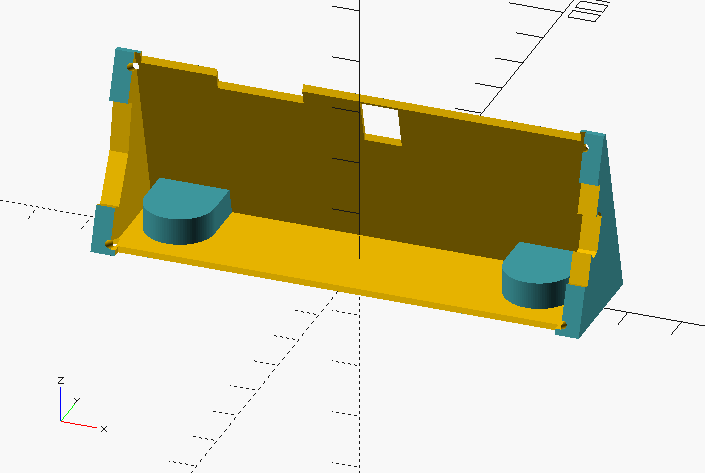

<p align="center">
  
</p>

## Print conditions
- PLA, 0.2 mm, 180 ℃
- `shihen-case` [[stl](./shihen-case.stl)]: Rotate so that the -YX(backbanel) plane is facing down.

## Dependencies
- openscad-nightly (`20181009T230242.gitf3de0e27+2416.1`)

## Build
```sh
$ make -j4
```

